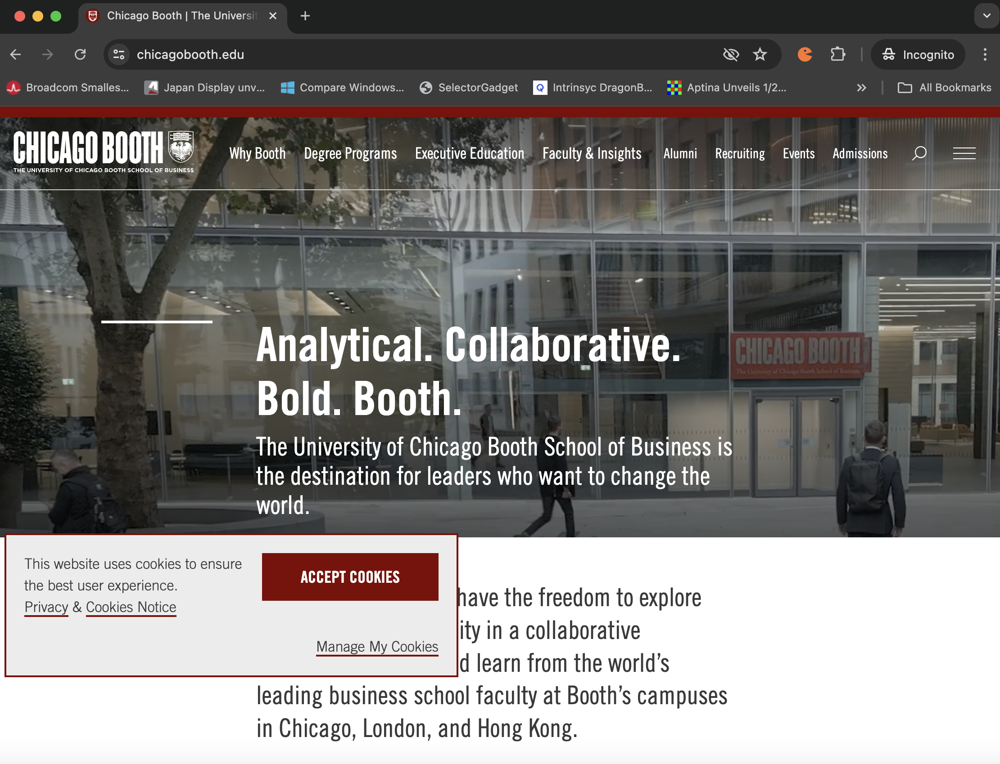
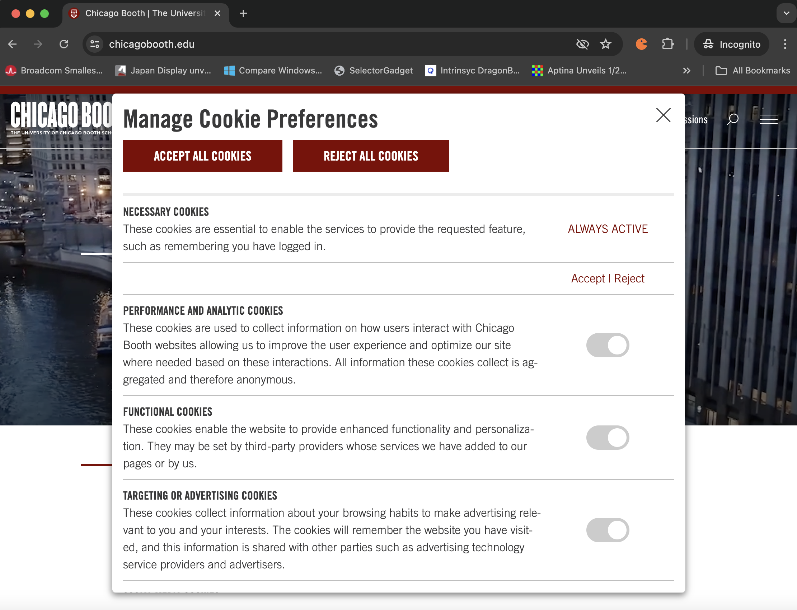

# Cookie Banner Dataset

## Overview
The Cookie Banner Dataset contains text and button data from cookie consent banners scraped from several hundred websites. This dataset is intended for researchers studying data privacy, user consent, and web interactions.

## Cookie Banner Structure

The structure of the dataset is such that it stores both the external and internal cookie banner data for a given website.
This section explains the two parts to modern cookie banners.

### External Banner

This is the cookie banner present on the main webpage that the user first interacts with. Typically, it is small, does not cover the entire webpage, and has very few options, like "Accept All", "Manage Preferences", and "Reject All" at the maximum. Usually, it only has one or two options.

Here is an example of an external banner.




## Internal Banner

This refers to the cookie banner presented after the user clicks "manage my preferences" or an equivalent button. It typically contains more detailed options like "Marketing", "Performance" cookies and more, and sometimes even toggles regarding Share and Sale of Personal Information.

Here is an example of an internal banner.




## Data Collection
The data was collected using two scraper functions deployed on AWS Lambda. These functions were designed and implemented as part of a project for a Large Scale Computing class.

### Scraper Function Details
The scraper functions are written in Python and are responsible for visiting websites and extracting cookie banner text and buttons. The functions were triggered periodically to ensure a wide range of data collection.

### Data Collection Process

The Cookie Banner Dataset was collected using two AWS Lambda functions designed to scrape cookie consent banners from various websites. The scraping process involved the following steps:

1. **Lambda Function Setup:**
   - Two scraper functions were implemented in Python and deployed on AWS Lambda.
   - These functions were triggered periodically to visit a predefined list of websites and collect data.

2. **Web Scraping Process:**
   - **Launching Browser:**
     - The scraper functions use a headless browser (Selenium WebDriver) to navigate to each website.
     - The browser is launched using the `launch_browser` function, which sets up the Selenium WebDriver.

   - **Visiting Websites:**
     - The Lambda function receives a list of URLs to visit.
     - For each URL, the browser navigates to the website and waits for the page to load completely.

   - **Extracting External Cookie Banner:**
     - The HTML source of the page is retrieved, and the `get_external_banner` function is used to locate the external cookie banner on the website.
     - If a cookie banner is found, its text content is extracted.

   - **Parsing Cookie Banner with GPT:**
     - The extracted banner text is sent to a GPT model to generate a response that includes button labels and actions associated with the cookie banner.
     - The response is processed to identify buttons such as "Accept All," "Reject All," "Confirm My Preferences," etc.

   - **Validating Buttons:**
     - The identified buttons are validated using the `validate_buttons` function to ensure accuracy and relevance.
     - The validated button data is stored along with the banner text.

   - **Handling Internal Cookie Banners:**
     - If the initial banner click leads to additional internal cookie banners, the `get_internal_banner` function retrieves these banners.
     - The `get_internal_buttons` function extracts button information from internal banners.

   - **Storing Data:**
     - The collected data (URL, external banner text, external buttons, internal texts, and internal buttons) is stored in an S3 bucket.
     - The data is structured in a JSON format and uploaded to the specified S3 location.

3. **Lambda Handler:**
   - The `lambda_handler` function orchestrates the entire process, iterating through the list of URLs and applying the above steps to each.
   - Success and error counts are tracked and logged.

This comprehensive process ensures the dataset contains detailed and accurate information about cookie consent banners across various websites, making it a valuable resource for researchers studying data privacy and user consent mechanisms.

## Dataset Contents
The dataset contains the following columns:

- **Unnamed: 0:** An index column.
- **external_text:** The text content of the external cookie banner displayed on the website.
- **external_buttons:** A dictionary containing the button labels and their respective actions from the external cookie banner.
- **url:** The URL of the website from which the cookie banner was scraped.
- **internal_texts:** The text content of any internal cookie banners (if available).
- **internal_buttons:** A dictionary containing the button labels and their respective actions from the internal cookie banner (if available).

## Files
- **`cookie_banner_dataset_july_23_24.csv`:** This CSV file contains the scraped data with columns for URL, banner text, and buttons.
- **`external_banner_scraper_lambda.py`:** Python code file for the AWS Lambda scraper functions used to collect the data for the external cookie banner.
- **`internal_banner_lambda_scraper.py`:** Python file for the AWS Lambda scraper functions used to collect the data for the internal cookie banner.

## Usage
Researchers can use this dataset to analyze cookie consent mechanisms, study user interaction with cookie banners, and develop new methods for managing cookie preferences.

### Example Usage
Below is an example of how to read the dataset using Python:

```python
import pandas as pd

# Load the dataset
data = pd.read_csv('cookie_banner_dataset_july_23_24.csv')

# Display the first few rows
print(data.head())
```

## Acknowledgements
This dataset was created as part of a project for a Large Scale Computing class. Special thanks to Professors Marshini Chetty and Raul Castro Fernandez for the guidance and support.

## License
This project is licensed under the MIT License - see the LICENSE file for details.
